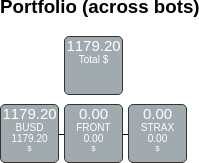

# Give data, get dashboards!

**Turn this**:

```json
{
	"title": "Portfolio (across bots)",
	"data": {
		"BUSD": [{
			"value": "1179.2033574600000000",
			"suffix": "BUSD"
		}, {
			"value": "1179.2033574600000000",
			"suffix": "$"
		}],
		"STRAX": [{
			"value": "0E-8",
			"suffix": "STRAX"
		}, {
			"value": "0E-16",
			"suffix": "$"
		}],
		"FRONT": [{
			"value": "0E-8",
			"suffix": "FRONT"
		}, {
			"value": "0E-16",
			"suffix": "$"
		}]
	}
}
```

Into this...



Howl is a generative dashboard. Based on what you push to the server, it'll generate a dashboard for you, and updates it real-time!

Through a series of intelligent converting and matching patterns, it'll continuously be expanded with support for more data structures and widgets. 

# Features

 - Written in Rust, offering libraries for Python, WebAssembly and Rust - all from the same codebase.
 - Real-time, using WebSockets.
 - Flexible, adding widgets to your existing codebase is extremely easy in case you need more support.
 - Easily customizable: The client has support for different CSS themes. Everything is self-explanatory thanks to the variables in the Stylus-based CSS code.
 

# Note: In development!

This project is in an experimental alpha stage and mustn't be used in production yet! So far there's little support for different types of JSON as I was mainly focussed on the right architecture.